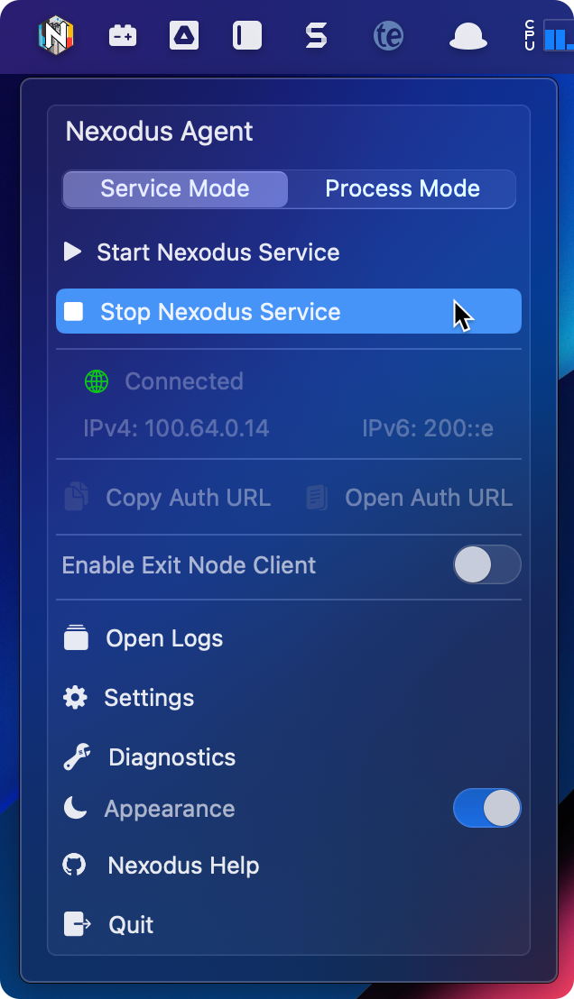
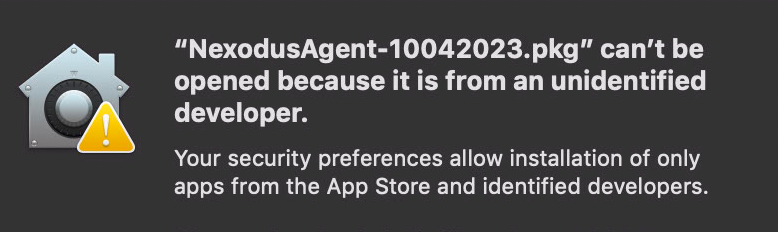
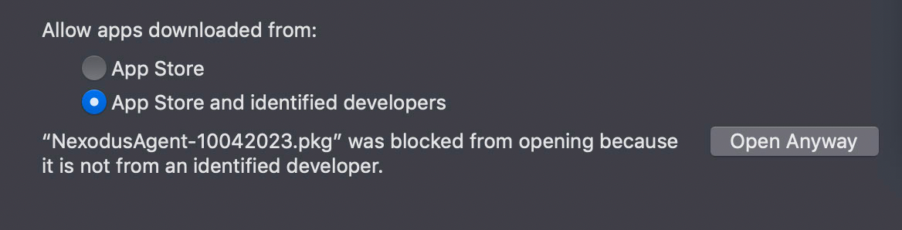
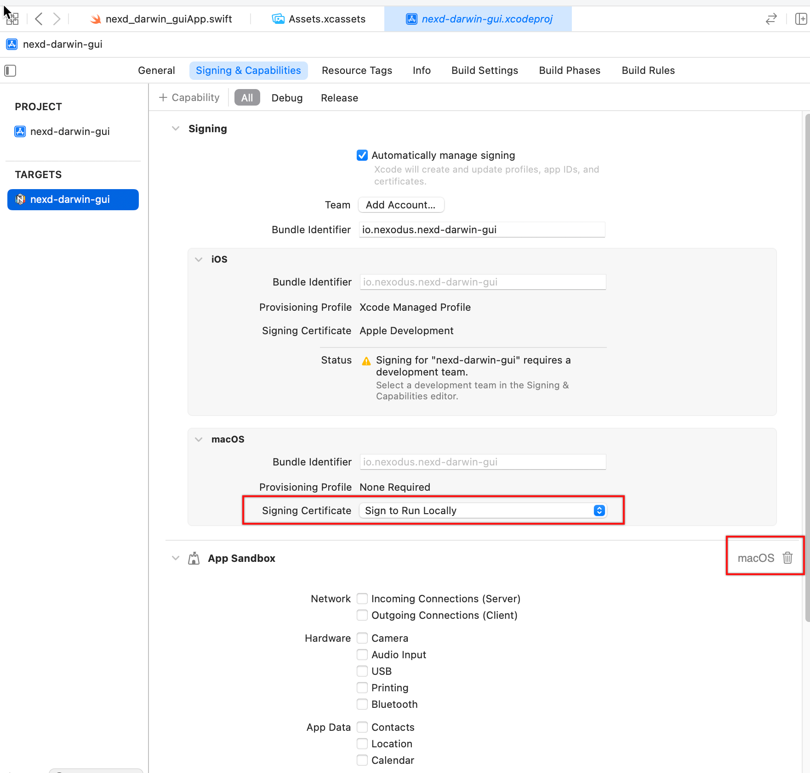

## Darwin Nexd Agent GUI

This is a WIP nexd GUI for Darwin written in Swift. Contributions are welcome!

### Quickstart

- Install the Nexodus brew package for macOS described in the [Nexodus Quickstart](https://docs.nexodus.io/quickstart/)
- Download and install the Neoxodus Agent GUI from this repo [NexodusAgent.pkg](./dist/NexodusAgent-10052023.pkg)
- Click on the `Naxodus Agent` app in the `/Applications` folder. The right click on the menubar and choose how you want to connect.
- Right click on the menubar app to start the service. If the host is not authenticated yet, the copy auth selection in the menu will be clickable and will copy the one-time auth to your clipboard to paste in a browser.



- `Connect`Nexodus starts nexd. If there are no cached credentials, the app will watch the log files for a one-time code for login. If credentials are cached, nexd will connect.
- `Disconnect`Nexodus tears down nexd and kills the processes, nexd and wireguard-go.
- `Start Nexd Service` starts the brew service.
- `Stop Nexd Service` stops the brew service.
- `Copy Auth URL` will copy the one-time Auth URL from the logs to your clipboard. From there you paste the URL into a browser.
- `Debug` opens tools for debugging and and install/uninstaler for the helper.
- `View Logs` Open nexd logs in the host's default text editor.
- Once the device connects and is registered, the v4 and v6 IPs are in the menu if they are present on the Nexodus wireguard interface.
- `Exit` Terminates the app. If running the default service mode, the service will continue running. If you reopen the App you can stop the service or even manually stop the service with: `sudo brew services stop nexodus-io/nexodus/nexodus`.

### Agent Install Signing Workaround

The packages isn't curerntly signed through the App store so you will need to make an exception for the package. 




To do this open the package and when prompted that it is from an unidentified developer, navigate to `System Preferences > Privacy and Security` click `Open Anyways`.



### Agent Removal

To remove, simply stop the service and delete these two files.

```console
sudo rm -rf /Applications/Nexodus\ Agent.app/
sudo rm /Library/PrivilegedHelperTools/io.nexodus.nexodus-gui.helper
```

### Development Environment with xcode

There are two components to this App. The GUI App `Nexodus Agent.app` in `/Applications/` and a helper process that handles priviledged executions as part of macOS excalated application framework `SMBJobless` located in `/Library/PrivilegedHelperTools/io.nexodus.nexodus-gui.helper`.

- Clone and open `NexodusAgentApp.xcodeproj` with your swift editor.
- In `Signing & Capabilities` of the project, select `Sing to Run Locally` and click the macOS trashcan under `App Sandbox` as shown in the following image.



- Next run the app by hitting the play button.


