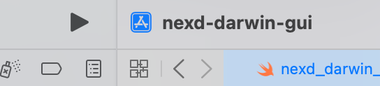

## Darwin Nexd GUI

This is a WIP nexd GUI for Darwin written in Swift. Contributions are welcome!

### Development Environment with xcode

- Clone and open `nexd-darwin-gui.xcodeproj`
- In `Signing & Capabilities` of the project, select `Sing to Run Locally` and click the macOS trashcan under `App Sandbox` as shown in the following image.

- Next run the app by hitting the play button.

### Basic Functionality

The basics are a dropdown menubar. Until we add a privileged helper such as [SMJobBless](https://developer.apple.com/library/archive/samplecode/SMJobBless/Introduction/Intro.html), most of the options will prompt for the sudo password for starting, stopping and terminating `nexd` and `wireguard-go`. The following is a brief summary of each option shown in the image below.

- `Connect` starts nexd. If there are no cached credentials, the app will watch the log files for a one-time code for login. If credentials are cached, nexd will connect.
- `Disconnect` tears down nexd and kills the processes, nexd and wireguard-go.
- `Copy Auth URL` will copy the one-time Auth URL from the logs to your clipboard. From there you paste the URL into a browser.
- `Settings` menu entry (not implemented).
- `View Logs` Open nexd logs in the host's default text editor.
- Once the device connects and is registered, the v4 and v6 IPs are in the menu if they are present on the Nexodus wireguard interface.
- `Exit` Terminates the app with `exit(0)`. This does not disconnect `nexd` or pkill `wireguard-go`.
