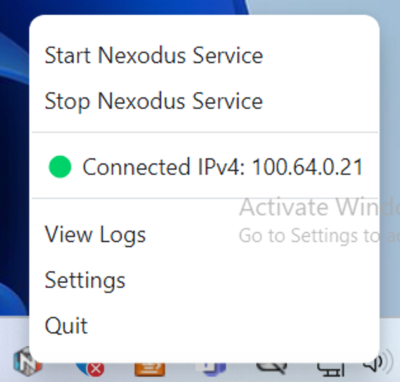

## Linux and Windows Nexodus Agent GUI

This is a WIP cross-platform GUI for Linux and Windows written in Typescript using the [Electron](https://www.electronjs.org) framework. The app is currently a tray icon app that looks as follows.

- Linux Electron toolbar rendering


-Windows Electron tray rendering:



### Run

Install [Nexodus RPM or Deb](https://docs.nexodus.io/quickstart/) which installs the Nexodus systemd service and then run the app. Since this is in dev there is no packaging as yet, so you will just run from source.

```
git clone https://github.com/nexodus-io/nexd-agent-gui
cd linux-windows/

# Install dependancies
npm install

# Run the app
npm run start
```

- `Connect` starts the nexd service. If there are no cached credentials, the app will watch systemd logs for a one-time code for login. If credentials are cached, nexd will connect. Credential prompt occurs here since you are starting a systemd service.
- `Disconnect` tears down nexd and kills the processes, `nexd.exe` and `wireguard.exe`.
- `Open Auth URL` will copy the one-time Auth URL from the logs to your clipboard. From there you open the URL into a browser.
- `Settings` menu entry (not implemented).
- `View Logs` Open nexd logs in the host's default text editor.
- Once the device connects and is registered, the v4 and v6 IPs are in the menu if they are present on the Nexodus wireguard interface.
- `Exit` Terminates the app. The systemd nexd service will continue to run.

### Packaging

To package the electron App for Windows and Linux, run the following:

```text
### Linux
npm run package-linux-arm64
npm run package-linux-x64

### Windows
npm run package-windows-arm64
npm run package-windows-x64
```

To Package Windows on Linux, you need to have `wine64` installed. See the CI actions for an example.

### Misc

If you don't have node/npm installed you can use the [node version manager](https://github.com/nvm-sh/nvm) to get up and running quicky.

Linux:

```shell
curl -o- https://raw.githubusercontent.com/nvm-sh/nvm/v0.39.5/install.sh | bash
nvm install --lts
```

Windows: Install the MS recommended nvm from this repo [nvm-windows](https://github.com/coreybutler/nvm-windows)
