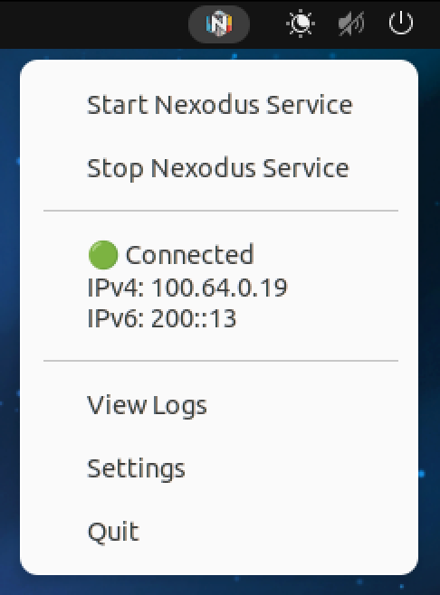

## Window Nexd Agent GUI

This is a WIP nexd GUI for Linux written in Typescript using the [Electron](https://www.electronjs.org) framework. The app is currently a tray icon app that looks as follows.



### Run

Install Nexodus, then download the gui binary from the [dist](./dist) and run the app. This uses [sudo-prompt](https://www.npmjs.com/package/sudo-prompt) for privileged escalation when stopping and starting the nexodus service.


### Dev

For development, build and run with the folllowing.

```
git clone https://github.com/nexodus-io/nexd-agent-gui
cd nexd-agent-gui/linux

# Install dependancies
npm install

# Run the app
npm run
```

### Packaging

To package the electron App, run the following.

```text
### ARM64
electron-packager . nexodus-agent-gui --platform=linux --arch=arm64

### x64
# electron-packager . nexodus-agent-gui --platform=linux --arch=x64
```
