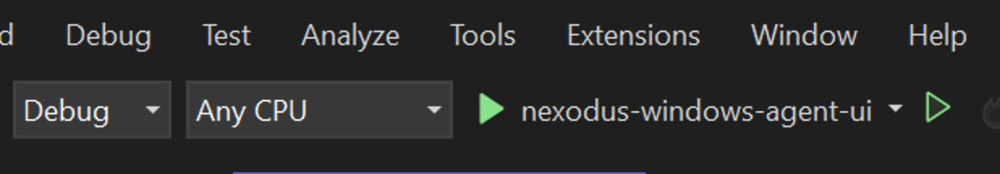
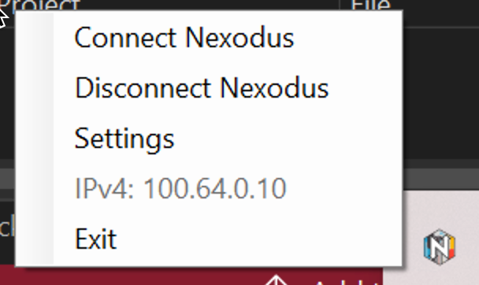

## Window Nexodus Agent GUI

This is a WIP nexd GUI for Windows written in C#. Contributions are welcome!

### Development Environment with Visual Studio

Install [nexd for windows](https://docs.nexodus.io/quickstart/#windows). Make sure the `nexd.exe` binary is located in the root of the `C:\` drive until a final home for the binary is decided.

Next setup Visual Studio or whichever C# enabled IDE you are using.

- Start Visual Studio as run-as Administrator.
- Clone the repo and in VS got to File > Open > Project/Solution and browse to this repo in the windows directory and locate the file named `nexodus-windows-agent-ui.csproj`
- Install the dependency `System.Windows.Forms` using the following directions.
  - Right-click on your project in the Solution Explorer.
  - Select "Manage NuGet Packages..."
  - Click on the "Browse" tab.
  - Search for "System.Windows.Forms" and "System.Drawing.Common".
  - Install the first package returned.

- Build and run the app by hitting the play button. This will add a Nexodus icon to the Windows desktop tray in the bottom right of the desktop. Interact with the app by right-clicking on the icon.
- Every time you build the project, there is a directory `bin\Debug\net6.0-windows\` that contains the built executable if you would prefer to run that directly. If you do run the exe, ensure the privileges are elevated by running as Administrator.

### Basic Functionality

 The following is a brief summary of each option shown in the image below.

- `Connect` starts nexd. If there are no cached credentials, the app will watch the log files for a one-time code for login. If credentials are cached, nexd will connect.
- `Disconnect` tears down nexd and kills the processes, `nexd.exe` and `wireguard.exe`.
- `Copy Auth URL` will copy the one-time Auth URL from the logs to your clipboard. From there you paste the URL into a browser.
- `Settings` menu entry (not implemented).
- `View Logs` Open nexd logs in the host's default text editor.
- Once the device connects and is registered, the v4 and v6 (TODO: v6) IPs are in the menu if they are present on the Nexodus wireguard interface.
- `Exit` Terminates the app. This will also kill the `nexd.exe` and `wireguard.exe` processes.
